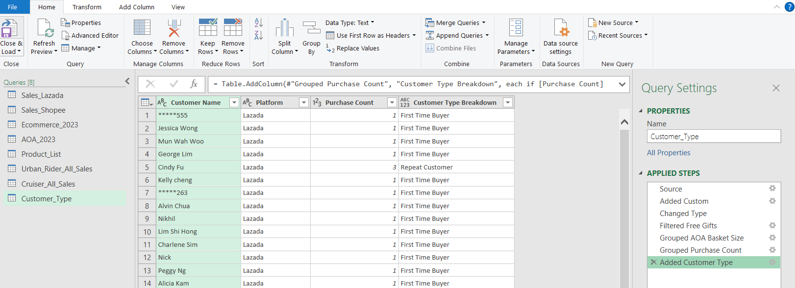
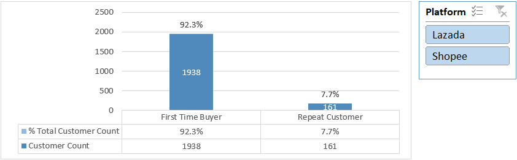

# Ecommerce Marketplace Analysis


## Introduction
Luna is a children's bike brand with e-commerce stores on both Lazada and Shopee. I set out to analyze customer purchasing behaviour and marketplace trends to identify opportunities to improve sales performance.

### Questions to analyze:
1. Which sales platform is generating the highest profit?
2. What are the top-performing categories and products?
3. Which model and color variations are most preferred by customers?
4. In which month do customers spend the most?
5. What is the average cart value and basket size per customer?
6. Are customers new or returning?


### Excel Skills Used  
The following Excel skills were utilized for analysis:

- 🧮 DAX (Data Analysis Expressions)
- 📈 Pivot Charts
- 📊 Pivot Tables
- 🖧 Power Pivot
- 🔍 Power Query

### Ecommerce Marketplace Dataset

The dataset used for this project contains real-world marketplace data on Shopee and Lazada from 2023. It includes detailed information including:

- 🛒 Order Number
- 🏷️ Seller SKU
- 📋 Item Name
- 💲 Unit Price
- 💸 Seller Discount
- 💰 Total Amount

### 🔍 Skill: Power Query (ETL)

#### 📥 Extract
- With Power Query, I extracted the original data from both platforms (`Lazada_2023` and `Shopee_2023`) and created an appended query `Ecommerce_2023` for my analysis. 
- Due to differences in data formatting between the two platforms, a standardized format was required for analysis. Lazada’s format was chosen for its simplicity, with a few adjustments made to suit the analysis requirements.

#### 🔄 Transform
3 key area that needed to be addressed were:

**⚠️ Item Quantity**

- Lazada’s dataset lists one item per row, while Shopee uses a quantity field to group items. This was resolved by creating a custom column to duplicate rows based on quantity.

   **Count** `=List.Repeat({""},[Quantity])`

 
**⚠️ Sales Amount**

- Lazada uses a single column for Unit Price, Seller Discount, Total Amount and Shipping Fees, while Shopee provides multiple detailed columns.
- Additionally, Lazada separates shipping from total, while Shopee includes it. These were resolved with the following custom columns:

    **Unit price** `=[Deal Price]+[Shopee Rebate]`

    **Seller Discount (Cart)** `=[Seller Voucher]+[Seller Absorbed Coin Cashback]`

    **Total Amount (No Shipping)** `=[Total Amount]-[Buyer Paid Shipping Fee]`

**⚠️ Seller Discount**
- Following Lazada’s format, seller discounts are split proportionally per item (e.g., a $5 voucher across two items). 

   

- Similarly, we can also create a Seller Discount custom column for the Shopee dataset.
 
   **Seller Discount** `=if [Seller Discount (Cart)] = 0 then 0 else ([Unit Price] / [Total Amount (No Shipping)]) * [Seller Discount]`
 
 #### 🔗 Load 
- Finally, I loaded the appended query which sets the foundation for my subsequent analysis.

   

##  1️⃣ Which sales platform is generating the highest profit?

### 🧮 Skills: PivotTables & PivotCharts

#### 📈 PivotTables & PivotCharts
- I created a PivotTable and a column PivotChart with `Order Time (Month)` as the axis, `Platform` as the legend, and `Total Amount` as the values.

  

- An additional pie PivotChart showing % of Grand Total was added for easier comparison.

### 📊 Analysis
#### 💡 Insights


- Shopee consistently outperformed Lazada in most months, contributing 54.2% of annual sales compared to Lazada’s 45.8%. 
- Notably, Lazada’s March sales spiked during its birthday campaign, outperforming Shopee that month.

#### 🥱 So What?
1. Identify key factors driving better performance, such as campaign timing, voucher usage, and pricing strategies.
2. Leverage successful strategies from Shopee store to enhance listings and overall performance of Lazada store.
3. If the performance gap persists, consider reallocating more ad spend and inventory to Shopee to maximize ROI.

## 2️⃣ What are the top-performing categories and products?
### 🧮 Skills: Power Query, PivotTables & PivotCharts

#### 🔍 Power Query
Since Luna has 9 gear items in store and the rest are accessories, I created a custom column `Product Category` with Power Query:

``` 
=if List.Contains({
    "Luna X1 Urban Rider",  
    "Luna X3 Urban Rider",  
    "Luna X5 Urban Rider",
    "Luna X Galaxy Urban Rider",
    "Luna X Shadow Urban Rider",
    "Luna Cosmic Cruiser",
    "Luna Cosmic Cruiser Galaxy",
    "Luna Cosmic Cruiser Nimbus",
    "Luna Cosmic Cruiser Shadow" 
}, [Item Name]) 
then "Gear" 
else "Accessories"
```

#### 📈PivotTables & PivotCharts
**Top Product Category**
- `Product Category` was moved to the axis and `Total Amount` to the values, and a clustered bar PivotChart was added to show annual sales by % of the Grand Total for easier comparison.

**Top Products**
- `Item Name` was moved to the axis, `Total Amount` to the values and filtered to include only Gear items, along with their annual sales by % of the Grand Total.

### 📊 Analysis
#### 💡 Insights


- As high-ticket items (ranging from $200–$800+), Gears contributed to over 90% of annual sales, compared to lower-priced Accessories (ranging from $9–$200+). 


- The top three best-selling products are the X3 Urban Rider (34.6%), X5 Urban Rider (27.3%), and Cosmic Cruiser(24.0%).

## 3️⃣ Which model and color variations are most preferred by customers?

### 🧮 PivotTables, PivotCharts, PowerPivot & DAX

#### 🖧 Power Pivot

- I created a data model integrating `Urban_Rider_All_Sales`, `Cruiser_All_Sales` and `Product_List`, with a relationship with the `Seller SKU` column. 

   

#### 🧮 DAX
- A `Color Variation` column was created using DAX.

   `=RELATED(Product_List[Color Variation])`

   

#### 📈 PivotTables & PivotCharts

**Top-Selling Models**

- A PivotTable and a column PivotChart were created with `Item Name` as the axis and `Total Amount` as the values along with clustered bar PivotChart showing % of Grand Total.

**Top Colour Variations**

- A PivotTable and column PivotChart were created using `Item Name` as the axis, `Color Variation` as the legend, and `Total Amount` as the values. Another clustered bar chart showing % of Grand Total was added for comparison.

 ### 📊 Analysis
#### 💡 Insights


- The Cosmic Cruiser dominated its series contributing 94.1% of annual sales, outperforming other limited edition models.

- While color preferences were close, Jet Black was the top choice.


- X3 and X5 models drove over 80% of annual sales in the Urban Rider Series.
- There’s a clear preference for subtle colors - Fossil Grey over Red (X1), Sage Green over Neon Blue/Fire Red (X3), and Jet Black over Sage Green (X5).

#### 🥱 So What?
1. Data suggests that customers prioritize functionality over exclusivity of limited edition models.
2. Invest in marketing and inventory for top-selling models and colors as they are the primary revenue drivers.
3. Use limited edition models to boost brand excitement and drive short-term sales, not as mainstream revenue.
4. Introduce limited edition models  with non-limited models to create upsell opportunities.

## 4️⃣ In which month do customers spend the most?
### 🧮 PivotTables & PivotCharts

- I created a PivotTable and a column PivotChart with `Order Time (Month)` as the axis and `Total Amount` as the values.

- `Platform` slicer and `Order Time` timeline were added to enable in-depth analysis by platform and time of year.

 ### 📊 Analysis
#### 💡 Insights


- Lazada peaked in March (Birthday Sale), September (9.9), and November (11.11).


- Shopee peaked in July (7.7, Mega Online Baby Fair, GSS Sale), October (10.10), and November (11.11).

- November (11.11) was the strongest month for both platforms, aligning with the year’s biggest sale.

#### 🥱 So What?
1. Months of spikes suggest that sales performance is highly campaign driven.
2. Shopee’s July surge shows that stacking multiple smaller scale campaigns can match the impact of major campaigns.
3. Align promotions and inventory planning around mega campaign periods, especially Q3–Q4.

## 5️⃣ What is the average cart value and basket size per customer?

### 🧮 Power Query, PivotTables & PivotCharts
#### 🔍 Power Query
In Power Query, a new query `AOA_2023` was created to perform a Group By on `Order ID`, `Customer Name`, `Platform`, and `Order Time`, with aggregations including the sum of `Cart Value` and a row count for `Basket Size`.


#### 🧮 PivotTables, PivotCharts

To analyze the relationship between average `Cart Value` and `Basket Size`, a combo PivotChart was created with `Order Time (Month)` on the axis, `Platform` as the legend, and average values of `Cart Value` and `Basket Size` in the values field. The chart uses a dual-axis format to display `Cart Value` on the primary axis and `Basket Size` on the secondary axis.

 ### 📊 Analysis
#### 💡 Insights


- 💰 Lazada shows a higher average cart value of $282.46, compared to Shopee's $264.20.

- 🛒 Both platforms have the same average basket size of 1.2, which suggests that customers buy a similar number of items per order on average.

- 📈 Lazada has greater fluctuations in cart value during different months, while Shopee’s cart value remains consistent throughout the year.

#### 🥱 So What?

1. Despite having the same annual average basket size, Lazada’s higher cart value suggests that customers tend to purchase more higher ticket items.
2. The data also indicates that a larger basket size doesn’t necessarily result in a higher cart value, highlighting the impact of pricing and discount strategies over quantity.
3. Lazada’s average cart value peaks in September ($331.24) and October ($316.96), driven by year-end mega sale events, whereas Shopee’s highest average cart value occurs in November ($298.59), coinciding with the 11.11 sales.

## 6️⃣ Are customers new or returning?

### 🧮 Power Query, PivotTables & PivotCharts

#### 🔍 Power Query

- In Power Query, a Group By transformation was applied on `Customer Name` and `Platform` with a row count aggregation to calculate `Purchase Count`. 

   

- A conditional column `Customer Type Breakdown` was then created to classify customers. Those with a `Purchase Count` > 1 were labelled as Repeat Customers, while others were labelled as First-Time Buyers.

   

#### 🧮 PivotTables, PivotCharts
- A PivotTable and PivotChart were created with `Customer Type Breakdown` on the axis, and `Customer Count` along with `% of Grand Total Customer Count` in the values field.

 ### 📊 Analysis

#### 💡 Insights


- Lazada -92.2% First Time Buyer, 7.8% Repeat Customers
- Shopee - 92.4% First Time Buyer, 7.6% Repeat Customers
- Overall - 92.3% First Time Buyer, 7.7% Repeat Customers

#### 🥱 So What?
1. The data shows that majority of customer (92.3%) are first time buyers across both platforms. This highlights a strong acquisition trend but also indicates a challenge in driving repeat purchases.
2. This pattern is likely influenced by Luna's focus on children's scooters that has a limited lifespan as children quickly outgrow them.
3. Invest in marketing that targets new buyers through parent-focused campaigns, promotions during gifting occasions (e.g., birthdays, holidays), and partnerships with parenting communities.
4. Expanding the product line to include products suited for older children to extend customer lifetime value.

### ✍️ Summary
The analysis revealed several key insights into Luna’s sales performance and customer behavior:

- **Sales Platform:** Shopee outperforms Lazada,suggesting opportunities to optimize sales or increase ad spend on Shopee.

- **Top-Performing Products:** Top products Models like Cosmic Cruiser and X3 Urban Rider, and colors such as Fossil Grey and Jet Black, indicates strong customer preference,that can guide future inventory and marketing focus.

- **Monthly Spending Trends:** Customer spending surges, often aligned with mega campaign events like 9.9 and 11.11, indicating the importance of timed promotions.

- **Cart Value vs. Basket Size:** Lazada has a higher average cart value despite similar basket sizes, indicating more high ticket purchases or effective upselling.

- **Customer Type:** With about 85% first-time buyers, Luna excels at acquisition but has limited repeat business, likely due to product lifecycle limits.

**⚠️Disclaimer:** This dataset is based on real-world data but certain elements such as brand name, item names, and other potentially sensitive identifiers have been modified to maintain confidentiality.