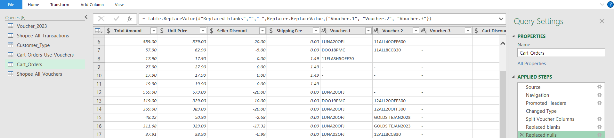
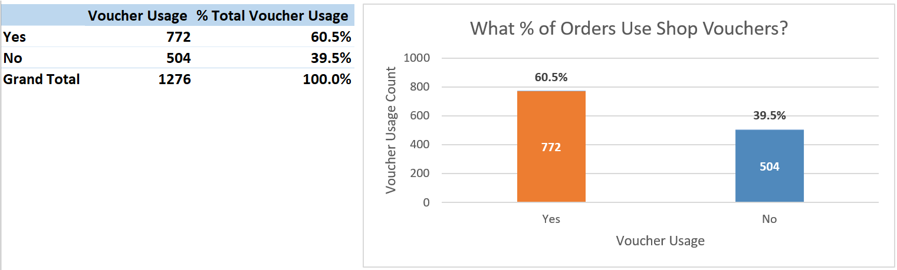
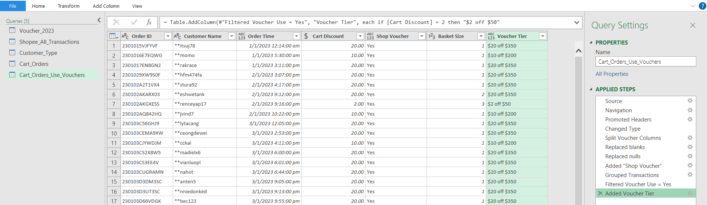
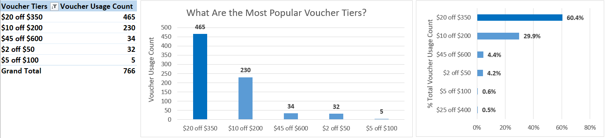
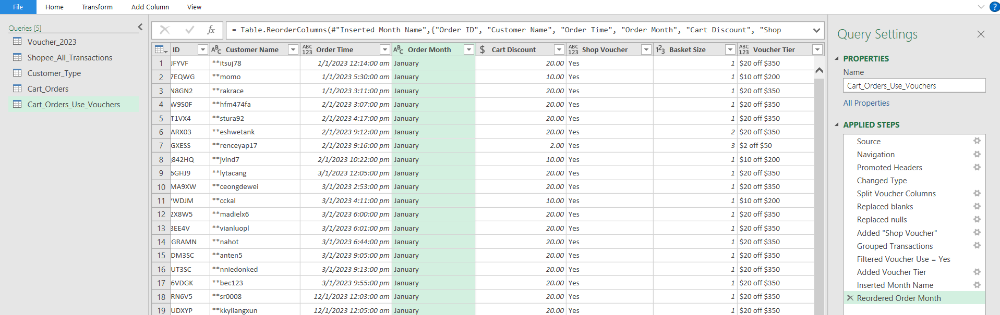
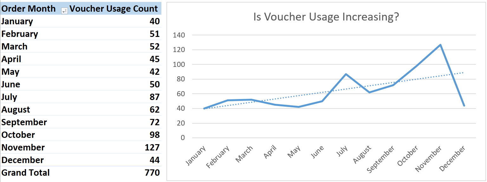
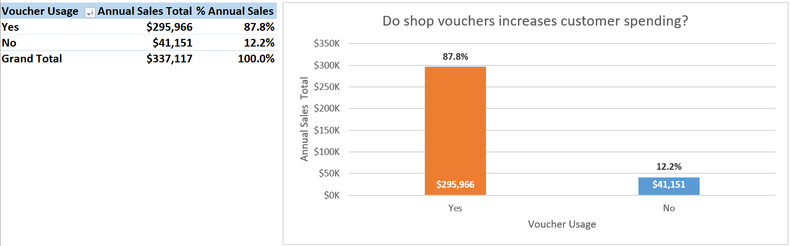
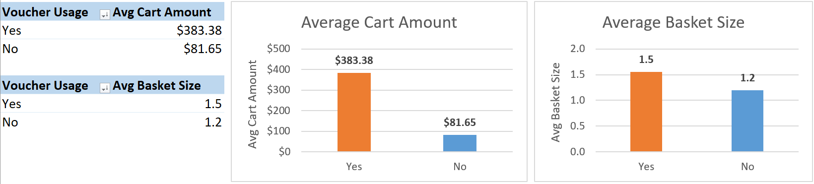
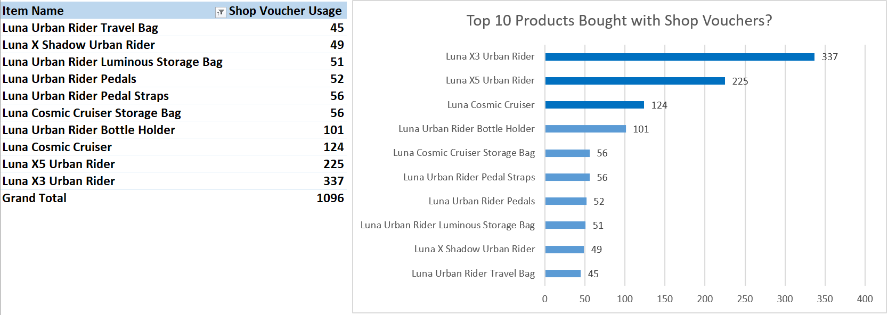

# Shopee Voucher Analysis

## Introduction
This project analyzes customer voucher usage in Luna's Shopee Store to understand how shop vouchers influence spending behaviour. The objective is to identify trends and strategies to optimize shop vouchers and drive revenue.

### Questions to analyze:
1. What percentage of total orders use shop vouchers?
2. Which shop voucher tiers are most frequently used?
3. Is shop voucher usage increasing over time?
4. Do customers spend more when using shop vouchers?
5. Which products are most frequently purchased with vouchers?

### Excel Skills Used  
The following Excel skills were utilized for analysis:

- 📈 Pivot Charts
- 📊 Pivot Tables
- 🖧 Power Pivot
- 🔍 Power Query

### Shopee Voucher Dataset

The dataset used for this project contains real-world marketplace data on Shopee from 2023. It includes detailed information including:

- 🛒 Order Number
- 📋 Item Name
- 💲 Unit Price
- 💸 Seller Discount
- 🏷️ Seller Voucher
- 💰 Total Amount

##  1️⃣ What percentage of total orders use shop vouchers?
### 🧮 Skills: Power Query, PivotTables & PivotCharts
#### 🔍 Power Query

- To clean the data, I split the `Voucher` column by delimiter which resulted in three new columns: `Voucher.1`, `Voucher.2`, and `Voucher.3` in Power Query.

   

- Since all shop vouchers contain "LUNA", I created a custom column `Shop Voucher` to categorize voucher usage as "Yes" or "No":

  ```m
  = if Text.Contains([Voucher.1], "LUNA") 
       or Text.Contains([Voucher.2], "LUNA") 
       or Text.Contains([Voucher.3], "LUNA") 
     then "Yes" 
     else "No"
     ```

- Then, I performed a Group By transformation on `Order ID`, `Customer Name`, `Order Time`, `Cart Discount` and `Shop Voucher` with aggregations including the sum of `Cart Amount` and a row count for `Basket Size`.

#### 📈 PivotTables & PivotCharts
- A PivotTable and a column PivotChart were created with `Shop Voucher` as the axis and both the sum and % of Grand Total for `Voucher Usage` as the values.

### 📊 Analysis
#### 💡 Insights

  

- 60.5% of the annual total orders uses voucher and 39.5% do not.
- This indicates that the shop vouchers were effective in driving sales, but there is still potential to increase voucher usage.

## 2. Which shop voucher tiers are most frequently used?
### 🧮 Skills: Power Query, PivotTables & PivotCharts

#### 🔍 Power Query
- With the Shop Voucher filtered as "Yes," a new query named `Cart_Orders_Use_Vouchers` was created to categorize the `Cart Discount` according to their voucher tiers using a custom column:

  ```m
  = if [Cart Discount] = 2 then "$2 off $50"
    else if [Cart Discount] = 5 then "$5 off $100"
    else if [Cart Discount] = 10 then "$10 off $200"
    else if [Cart Discount] = 20 then "$20 off $350"
    else if [Cart Discount] = 25 then "$25 off $400"
    else if [Cart Discount] = 45 then "$45 off $600"
    else "Other"
  ```
   

#### 📈PivotTables & PivotCharts

- A PivotTable and column PivotChart were created with `Voucher Tier` as the axis and the sum of `Voucher Usage` as values. Another clustered PivotChart used `Voucher Tier` as the axis and % of Grand Total for `Voucher Usage` as the values.


### 📊 Analysis
#### 💡 Insights


- The top-used shop voucher was "$20 off $350" (60.4%), followed by "$10 off $200" (29.9%). 
- The remaining vouchers account for less than 6% of total voucher usage.

#### 🥱 So What?
- The two top-used voucher tiers target the $200–$300+ Urban Rider Series, Luna’s best-sellers, proves to be effective in driving usage. Introducing more voucher tiers around this range could encourage accessory add-ons and boost spending.

- The "$45 off $600" voucher target the $500+ Cosmic Cruiser Series but has significantly lower usage which might be due to the price gap between product price and voucher threshold. Lowering the voucher tier could make it easier for customers to reach with accessory add-ons.

- For other vouchers with low usage, analyze which products align with the voucher threshold and adjust them accordingly.

## 3️⃣ Is shop voucher usage increasing over time?

### 🧮 Skills: Power Query, PivotTables & PivotCharts
#### 🔍 Power Query

- `Order Month` column was created by using add column by example on `Order Time` column.

   

#### 📈 PivotTables & PivotCharts

- I created a PivotTable and a line PivotChart with `Order Month` for the axis and `Voucher Usage` for values. 

 ### 📊 Analysis
#### 💡 Insights

   

- The line chart shows a general uptrend in voucher usage, especially in Q3 and Q4.
- There is a spike in voucher usage in July and climbs further from September to November.
- Voucher usage dips to its lowest point in December.

#### 🥱 So What?

- The spikes and peaks in voucher usage during Q3 and Q4 indicate that customers are price sensitive and highly driven by promotions during the mega campaign period.

- The dip in December could suggest that customers took advantage of vouchers during earlier mega campaigns and are less inclined to make additional purchases afterward.

## 4️⃣ Do customers spend more when using shop vouchers?

### 🧮 PivotTables & PivotCharts
#### 📈 PivotTables & PivotCharts
- A PivotTable and column PivotChart were created using `Shop Voucher` as the axis, with both the sum and % of Grand Total for `Cart Amount` as values.

- Two additional column PivotCharts were created: one with `Shop Voucher` as the axis and average `Cart Amount` as the values, and another with `Shop Voucher` as the axis and average `Basket Size` as values.
 ### 📊 Analysis
#### 💡 Insights



- 87.8% of annual sales come from transactions with vouchers, showing strong customer interest in discounts. 12.2% represent smaller buys or in some cases customers might be unaware of shop vouchers.



- Voucher users spend 4.7x more on average ($383.38 Vs $81.65) and have a larger basket size (1.5 vs. 1.2), indicating vouchers drive bigger and  intentional purchases.

#### 🥱 So What?

- Data suggests customer segmentation into deal-seekers and casual buyers. By creating targeted marketing strategies for the two different groups can boost sales revenue.

- Increasing voucher visibility could convert more non-voucher users and boost sales.

- Further analysis in user spending habits can help in designing voucher tiers.

## 5️⃣ Which products are most frequently purchased with vouchers?

### 🧮 PivotTables & PivotCharts
#### 📈 PivotTables & PivotCharts

I created a PivotTable and clustered bar PivotChart with `Item Name` as the axis and `Voucher Usage` as the values, then filtered the top 10 items based on voucher usage count.

 ### 📊 Analysis
#### 💡 Insights



- The top 3 products bought with vouchers are all in the gear category: X3 Urban Rider, X5 Urban Rider, and Cosmic Cruiser.

- Products ranked 4-10 are mostly accessories, except for X Shadow Rider, which is also gear.

- Data suggests customers tend to use vouchers more for higher-ticket items and are more price sensitive for these purchases.

#### 🥱 So What?

- The popularity of these items during promotions indicates the need to stock up inventory accordingly to avoid loss of sales due to stockouts.

- Allocate higher budget for voucher promotions on high-ticket gear items to boost sales further.

- Accessories ranking in the top 10 can be bundled with gear in campaigns to increase average order value.

### ✍️ Summary

- Voucher Usage Rate: 60.5% of total orders use shop vouchers, highlighting their popularity among customers, though there is room for further optimization.

- Popular Voucher Tiers: "$10 off $200" and "$20 off $350" voucher tiers are used most frequently. Optimizing voucher thresholds can better appeal to buyers and boost sales revenue.

- Usage Trend: Shop voucher usage shows an increasing trend over time, especially during mega campaign periods in Q3 and Q4.

- Spending Impact: Customers spend 4.7 times more on average when using vouchers, with larger basket sizes and higher order values.

- Top Products: High-ticket gear products are most frequently purchased with vouchers, while popular accessories also show strong voucher usage.  

**⚠️Disclaimer:** This dataset is based on real-world data but certain elements such as brand name, item names, and other potentially sensitive identifiers have been modified to maintain confidentiality.